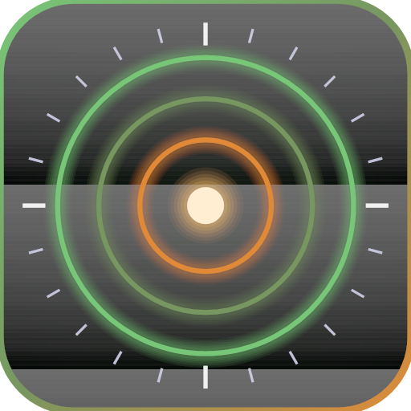

  

<h1 align="center">Kill Chain</h1>

  A universal Windows audio engine for headphones, speakers, and home theater — EQ, spatial processing, restoration, analysis, and playback in one focused workspace.

  
  
  

  <a href="#download"><strong>Download</strong></a> ·
  <a href="#install">Install</a> ·
  <a href="#features">Features</a> ·
  <a href="CHANGELOG.md">Changelog</a> ·
  <a href="https://github.com/JerryKoller/Kill-Chain/issues">Issues</a>

---

## Download

**[⬇ Download Kill-Chain-Setup-2.6.8.exe](https://github.com/JerryKoller/Kill-Chain/raw/main/Kill-Chain-Setup-2.6.8.exe)**

| | |
|---|---|
| **Version** | 2.6.8 |
| **File** | `Kill-Chain-Setup-2.6.8.exe` |
| **Size** | ~77 MB |
| **Platform** | Windows 10/11 (64-bit) |

Previous releases: [2.6.1](https://github.com/JerryKoller/Kill-Chain/raw/main/Kill-Chain-Setup-2.6.1.exe) · [2.6.0](https://github.com/JerryKoller/Kill-Chain/raw/main/Kill-Chain-Setup-2.6.0.exe) · [2.5.9](https://github.com/JerryKoller/Kill-Chain/raw/main/Kill-Chain-Setup-2.5.9.exe) · [2.5.8](https://github.com/JerryKoller/Kill-Chain/raw/main/Kill-Chain-Setup-2.5.8.exe) · [2.5.7](https://github.com/JerryKoller/Kill-Chain/raw/main/Kill-Chain-Setup-2.5.7.exe) · [2.5.6](https://github.com/JerryKoller/Kill-Chain/raw/main/Kill-Chain-Setup-2.5.6.exe) · [2.5.5](https://github.com/JerryKoller/Kill-Chain/raw/main/Kill-Chain-Setup-2.5.5.exe) · [2.5.4](https://github.com/JerryKoller/Kill-Chain/raw/main/Kill-Chain-Setup-2.5.4.exe) · [2.5.3](https://github.com/JerryKoller/Kill-Chain/raw/main/Kill-Chain-Setup-2.5.3.exe) · [2.5.2](https://github.com/JerryKoller/Kill-Chain/raw/main/Kill-Chain-Setup-2.5.2.exe) · [2.5.1](https://github.com/JerryKoller/Kill-Chain/raw/main/Kill-Chain-Setup-2.5.1.exe) · [2.5.0](https://github.com/JerryKoller/Kill-Chain/raw/main/Kill-Chain-Setup-2.5.0.exe) · [2.4.1](https://github.com/JerryKoller/Kill-Chain/raw/main/Kill-Chain-Setup-2.4.1.exe) · [2.4.0](https://github.com/JerryKoller/Kill-Chain/raw/main/Kill-Chain-Setup-2.4.0.exe) · [1.4.0](https://github.com/JerryKoller/Kill-Chain/raw/main/Kill-Chain-Setup-1.4.0.exe)

You can also use the [download page](https://jerrykoller.github.io/Kill-Chain/) if GitHub Pages is enabled on this repo.

---

## Install

1. Download the installer above.
2. Run `Kill-Chain-Setup-2.6.8.exe` and follow the setup wizard.
3. Launch **Kill Chain** from the Start menu or desktop shortcut.

### Windows security notice

Because Kill Chain is distributed outside the Microsoft Store, Windows may show a **“Windows protected your PC”** SmartScreen prompt the first time you run the installer. That is normal for independent software. Click **More info**, then **Run anyway**, if you trust this source.

---

## Features

| Module | What it does |
|--------|----------------|
| **Kill Chain** | Engage the full DSP path — EQ, bass/treble, spatial width, limiting, and more |
| **Sculptor** | Audio-repair workspace — Restoration Bay v2, Clarity Engine, Target Lock reference matching, Read &amp; Repair auto-enhance, processed bounce/export |
| **Calibration** | Hearing test, pure-tone calibration, headphone profiles, and **Deadflat** flattening |
| **Tractor Beam** | Full Chain Lock console — spectral analysis, health-guarded correction manifests, a searchable **Lock Library**, and hands-free **Auto-Lock** |
| **3rd Dimension** | 6DOF spatializer — Walk Mode, mission profiles, and optional opentrack head tracking |
| **Fire Command** | MK IV wavetable weapons platform — 1000 presets, Natural Selection mutate, 12-slot mod matrix, drum machine, piano roll, arrangement, mixer, automation lanes, MIDI record, stem export |
| **Airspace** | In-app browser with route-through-chain playback and per-source memory |
| **Mission Log** | Per-source memory — every track and stream gets its chain back automatically |
| **Scope** | High-resolution real-time spectrum and analysis |
| **Visualizer** | Reactive visuals with an automatic director (**Cinema Lock**) and broadcast output |
| **Armory** | Save and recall your own preset loadouts |

Open the in-app **Glossary** for definitions of every term and module.

---

## Requirements

- **OS:** Windows 10 or 11 (64-bit)
- **Audio:** Any Windows output device (built for high-quality headphones)
- **Optional:** [opentrack](https://github.com/opentrack/opentrack) for 3D head tracking · MIDI controller for Fire Command

---

## What's new

See **[CHANGELOG.md](CHANGELOG.md)** for full release notes.

**v2.6.8 highlights:** Genre-true mission demos · cooler fire boot splash.

**v2.5.6 highlights:** Symmetrical Delay/Reverb-style knob rows; Fire Mixer meter bridge (A/B/Drums/Samples/Master); deeper Morph, Output, OSC, Harmonic Forge Warp, Unison, Filter, Envelopes, LFOs, FM·Ring, Pitch·Glide. Display only.

**v2.5.5 highlights:** Lit collapse chevrons; Fire Mixer console; Morph Pad, OSC A–C, Performance, Warp, Unison, Filter, Envelopes, LFOs, FM·Ring and Pitch·Glide stage personalities. Display only.

**v2.5.4 highlights:** Everything below the piano roll is collapsible. Spectral Warp gold harmonic lattice, Output hi-DPI master trace, Fire Mixer bus-overview deck. Display only.

**v2.5.3 highlights:** FX stage personalities — Magma Forge (Drive), Sweep Notches (Phaser), Ensemble Shimmer (Chorus), Ping-Pong Corridor (Delay), Room Bloom (Reverb), Violet FFT Bay (Spectral). Display only.

**v2.5.2 highlights:** Macros, Trance Gate, and Mod Matrix get distinct stage personalities — amber command-cluster radar, ice chop-field silhouette, and green signal-bay cables with traveling packets. Display only; audio behavior unchanged.

**v2.5.1 highlights:** Arpeggiator visual overhaul — hi-DPI contour stage with depth and color shifting, targeting-reticle blooms on hits, and a symmetrical control layout. Same arp engine; sharper and more fun to watch.

**v2.5.0 highlights (Fire Command MK IV):** Natural Selection mutate — breed two candidate patches, audition A/B, keep the winner and evolve; 1000 factory presets; precision knobs with shift-drag fine tuning, click-to-type values, and reset; next/prev patch cycling; a rebuilt two-octave keyboard with octave scroll; live visualizations on every synth module; new arp modes with swing, accents, and ratchets; trance gate presets with smoothing and a playhead; a 12-slot mod matrix; ten genre-accurate mission packs; and fixes for filter-drive clipping and spectral FX misbehavior.

**v2.4.1 highlights:** Universal positioning — fresh installs default to Neutral correction; Playback Correction supports headphones, speakers, soundbars, TVs, and home theater; legal/trademark notices in Settings; proprietary licensing files for commercial distribution.

---

## Support

- **Bug or feature request?** [Open an issue](https://github.com/JerryKoller/Kill-Chain/issues/new/choose) — templates are set up to guide you.
- **Security concern?** See [SECURITY.md](SECURITY.md).

---

## License

Kill Chain is proprietary software. See [LICENSE](LICENSE). Draft [EULA](LEGAL/EULA.md) and [Privacy Policy](LEGAL/PRIVACY.md) are provided for attorney review before commercial sale. Compatibility profiles name third-party products for identification only — no endorsement is implied.

© 2026 Jerry Koller. All rights reserved.
