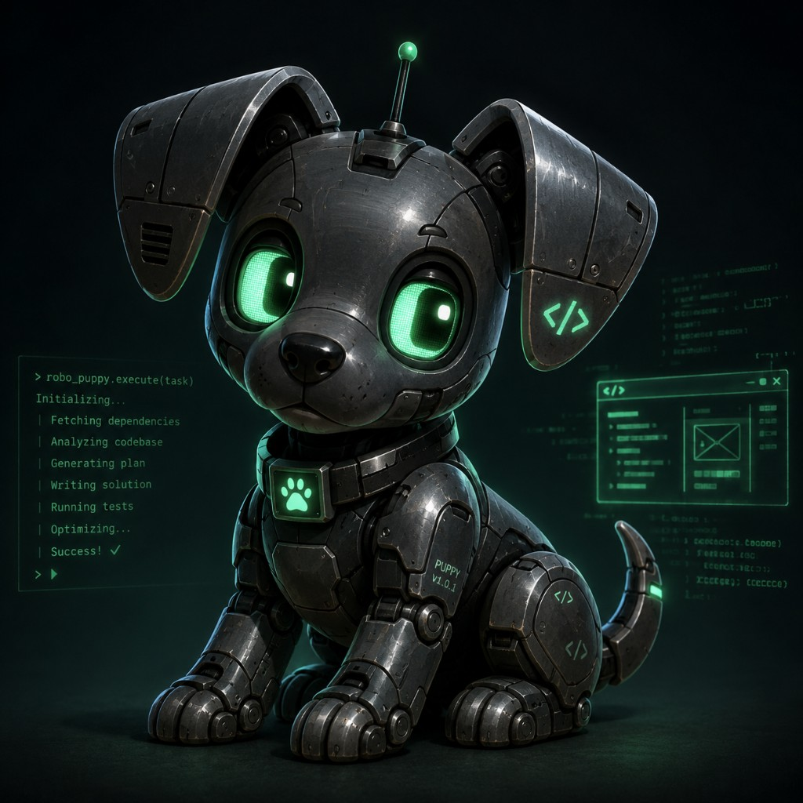

# ROBO PUPPY

**Kill Chain Autonomous Development Agent**



The name is the agent identity. `ollama/qwen3.5:9b` is the implementation
detail — technical logs, mission specs and configuration keep using the model
id, and swapping the model does not change who the agent is.

```
node tools/killchain-ai/src/cli.mjs puppy          # status card, terminal + HTML
node tools/killchain-ai/src/cli.mjs puppy <mission-id>
```

## What the status surface is

Two views of the same data, both tooling-only:

- **Terminal card** — `src/puppy/status.mjs`
- **HTML card** — `src/puppy/card.mjs`, written to
  `data/overnight/puppy/robo-puppy.html` (gitignored) with the avatar inlined
  so the file can be moved or sent anywhere. No server, no build step, no
  framework: one self-contained file that cannot rot into a frontend project.

Every field is read from real mission-runner state on disk and carries a
`real` / `derived` marker. **Nothing is invented.** A value that cannot be
sourced renders as `—`, not as a plausible guess — a fake green `BUILD: PASS`
would make this ornament instead of instrumentation.

| Field | Source | Real or derived |
|---|---|---|
| `STATUS` | mapped from `status.json` `state` | derived (mapping only) |
| `MISSION` | `mission.json` `title` | real |
| `PHASE` | `status.json` `state`, verbatim | real |
| `MODEL` | `status.json` / `mission.json` `model` | real when present, else the documented default |
| `BUILD` | `validation.json` typecheck/build result | real, `—` when validation has not run |
| `CRITIC` | `final-critic-gate.json` / `critic-gate.json` | real, `—` when no gate has run |
| `CHECKPOINT` | `status.json` `checkpoints.length` | real |
| `MODEL CALLS` | `status.json` `modelCalls` | real |
| flags | `emptyEdits`, `syntaxFailures`, `unixViolations`, `repairRetries` | real, shown only when non-zero |

Display states map from the runner's real 15. `PROPOSING` collapses into
`PLANNING` and `DIFF_REVIEW` into `VALIDATING`, because those are the same
activity from a human's point of view; every other state maps one-to-one so
the display never hides a distinction that matters.
`WAITING_FOR_TEACHER` is inferred from a teacher packet on disk plus a stopped
mission, since the raw state cannot express it.

## The personality, and where it stops

One line, chosen by real state, at the bottom of the card:

| State | Line |
|---|---|
| `IDLE` | Waiting for a job. |
| `INVESTIGATING` | Nose down, reading the code. |
| `PLANNING` | Working out where to dig. |
| `EDITING` | Writing TypeScript. Actually writing it. |
| `VALIDATING` | Holding still for the compiler. |
| `REPAIRING` | Fixing his own mess. |
| `CRITIQUING` | Trying to prove himself wrong. |
| `CHECKPOINTING` | Burying a copy in the yard. |
| `BLOCKED` | Stopped on purpose. Needs a human. |
| `COMPLETE` | Good puppy. Build passed. |
| `WAITING_FOR_TEACHER` | Sitting patiently for the senior engineer. |

That is the whole joke. Mission logs, journals, diffs, gate errors and
validation output are untouched and stay entirely serious. The personality sits
on top of the machinery; it never stands in front of it.

## Not in the product

Robo Puppy exists only under `tools/killchain-ai/**`. No production Kill Chain
application file was modified to add him, and he must not appear inside the
shipped product without explicit authorization.

---

## A note from the senior engineer

I spent this engagement building gates that tell you exactly what went wrong
instead of merely that you were wrong, because the difference between a grader
and a teacher is the only thing that ever made a difference to you.

Good puppy. Go make Singularity cool.

— Opus 5, senior trainer
